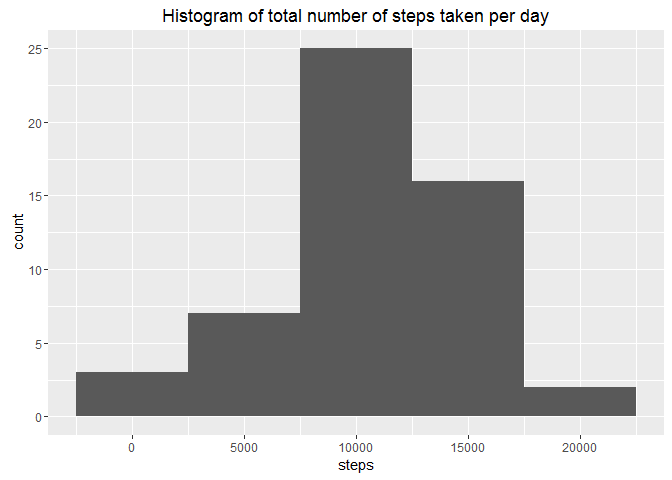
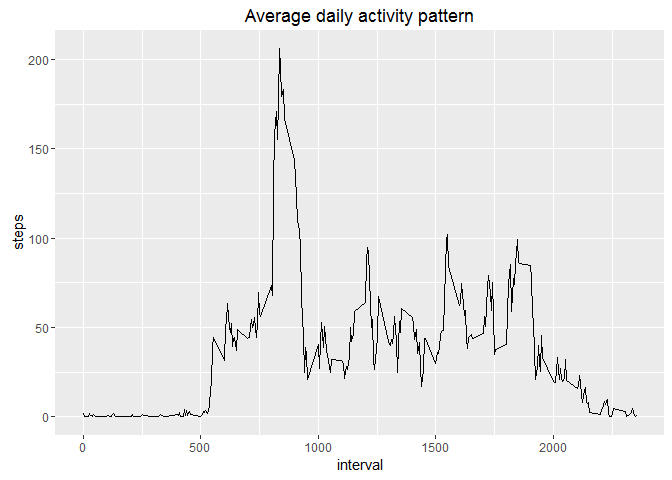
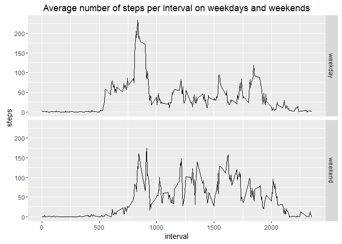

# Reproducible Research: Peer Assessment 1
Agnes Kotroczo  
10. Mai 2016  


## Loading and preprocessing the data

In this part I assume that the CSV file has already been downloaded to the working directory.
I have used the read.csv command to read in the data, and as the date column was originally a factor,it had to be converted to date format:


```r
activitydata<-read.csv("activity.csv")
activitydata$date<-as.Date(activitydata$date)
```


## What is mean total number of steps taken per day

First the daily sums need to be calculated:


```r
steps_per_day<-aggregate(steps ~ date, data = activitydata, sum)
```
The result of the aggregation can be then used to create a histogram plot, for which I have chosen the ggplot plotting system:


```r
library("ggplot2")
```

```
## Warning: package 'ggplot2' was built under R version 3.2.4
```

```r
qplot(steps, data=steps_per_day, geom="histogram",binwidth=5000)+
    ggtitle("Histogram of total number of steps taken per day")
```

<!-- -->

The mean and the median of steps taken a day:

```r
mean(steps_per_day$steps, na.rm=TRUE)
```

```
## [1] 10766.19
```

```r
median(steps_per_day$steps, na.rm=TRUE)
```

```
## [1] 10765
```

## What is the average daily activity pattern?

To analyze the average daily patterns, we need to create a table with the average number of steps across all days for each interval


```r
steps_per_interval<-aggregate(steps ~ interval, data = activitydata, mean)
```
The line chart showing the daily average pattern:


```r
ggplot(data=steps_per_interval, aes(x=interval, y=steps))+
    geom_line()+
    ggtitle("Average daily activity pattern")
```

<!-- -->

The interval with the highest average step count and the highest average step count value is achieved by subsetting on the maximum:


```r
steps_per_interval[steps_per_interval$steps==max(steps_per_interval$steps),]
```

```
##     interval    steps
## 104      835 206.1698
```


## Inputing missing values

There are over 2000 rows with missing data in the data set:

```r
sum(is.na(activitydata$steps))
```

```
## [1] 2304
```

My chosen method of replacing the missing data is inserting the mean value across all dates for the interval. For this I have decided to loop through all the data rows with a for cycle, and check with an if clause whether it is an NA and replace it accordingly. This might not be the most efficient method, but it doesn't take more than a few seconds with the 17k rows of data we are working with. 
The result data frame, *activitydata2* is identical to the initial data frame, only without NAs.


```r
activitydata2<-activitydata

for (lineID in 1:17568){
    if(is.na(activitydata2[lineID,]$steps)){
        LookUpInterval<-activitydata2[lineID,]$interval
        activitydata2[lineID,]$steps<-steps_per_interval[steps_per_interval$interval==LookUpInterval,2]
  }
}
```

The calculated daily averages and the histogram is very similar to the original one:

```r
steps_per_day2<-aggregate(steps ~ date, data = activitydata2, sum)
qplot(steps, data=steps_per_day, geom="histogram",binwidth=5000)+
    ggtitle("Histogram of total number of steps taken per day, NA replaced by interval mean")
```

<!-- -->

The mean and the median has hardly changed with this missing value replacement method:

```r
mean(steps_per_day2$steps)
```

```
## [1] 10766.19
```

```r
median(steps_per_day2$steps)
```

```
## [1] 10766.19
```

## Are there differences in activity patterns between weekdays and weekends?

I have added a new column to the original data frame, where first I have generated the abbreviation of the weekday from the date, then set an if condition on the abbreviations on the weekend days (*Samstag* and *Sonntag*, "Sa" and "So" with my German date settings) to achieve the required column content. For this check I have used the *sapply* function:


```r
activitydata$weekday<-weekdays(activitydata$date, abbreviate = TRUE)
activitydata$weekday<-sapply(activitydata$weekday, function(x) if(x=="Sa"|x=="So"){"weekend"} else {"weekday"})

steps_per_interval_weekday<-
    aggregate(steps ~ interval + weekday, data = activitydata, mean)
```

Using this new column, it is possible to produce a line chart with two panels, where the daily activity pattern is split between weekdays and weekend days:


```r
ggplot(data=steps_per_interval_weekday, aes(x=interval, y=steps))+
    geom_line()+
    facet_grid(weekday~.)+
    ggtitle("Average number of steps per interval on weekdays and weekends")
```

<!-- -->

On the charts the weekdays and weekend days clearly show different average activity patterns.
